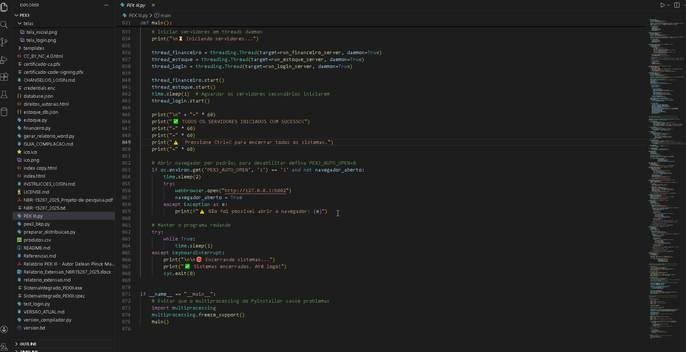
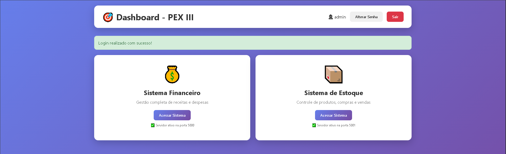
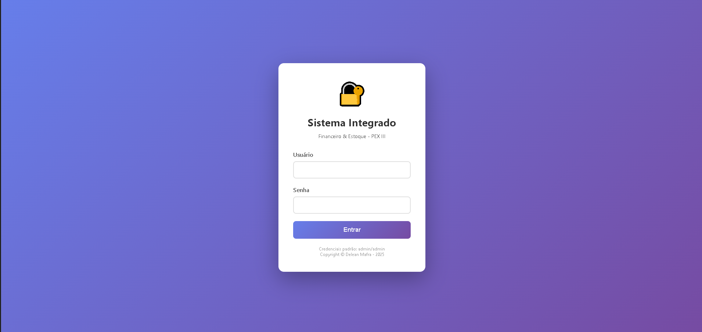
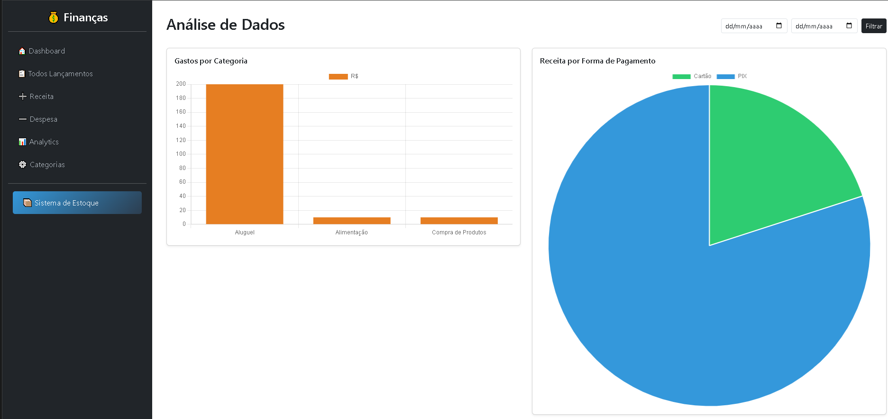

# 🎓 Projeto de Extensão III - Ciência de Dados

<p align="center">
  
</p>

<p align="center">
  
</p>

## 💼 Visão Geral

Este repositório documenta o **Projeto de Extensão III** do curso de Tecnologia em Ciência de Dados (CST - Centro Universitário União das Américas Descomplica), desenvolvido no **3º semestre**. O projeto consiste na aplicação prática de técnicas de ciência de dados para resolver problemas reais enfrentados por uma organização parceira.

---

## 🎯 Objetivo Geral do Projeto

Aplicar técnicas de **análise, modelagem e visualização de dados** para identificar e resolver problemas reais em uma organização parceira, gerando impacto positivo através de soluções baseadas em dados e inteligência analítica.

### Objetivos Específicos
- Realizar análise detalhada dos problemas e necessidades da instituição
- Identificar questões que possam ser abordadas com técnicas de ciência de dados
- Aplicar modelagem preditiva, visualização e análise de dados
- Propor intervenções baseadas em insights provenientes da análise
- Conectar teoria e prática através de soluções com impacto positivo

---

## 🏢 A Organização Parceira

O projeto foi desenvolvido em parceria com o **Mercado Dal-Bo Ltda**, uma empresa de varejo/comércio que enfrentava dificuldades significativas na gestão de suas operações financeiras e controle de estoque.

### 🔍 Problemas Identificados

#### Problema 1: Falta de Controle Financeiro
A organização não possuía um sistema adequado para gerenciar suas finanças:
- ❌ Registros manuais ou em planilhas desorganizadas
- ❌ Ausência de categorização de gastos
- ❌ Dificuldade em identificar padrões de despesas
- ❌ Impossibilidade de gerar relatórios analíticos
- ❌ Falta de visibilidade sobre a saúde financeira

#### Problema 2: Gestão de Estoque Ineficiente
O controle de estoque era precário:
- ❌ Desconhecimento do saldo real de produtos
- ❌ Falta de histórico de movimentações
- ❌ Ausência de alertas para estoque baixo
- ❌ Dificuldade em calcular lucro por produto
- ❌ Sem integração com o controle financeiro

---

## 💡 Solução Desenvolvida: Sistema Integrado PEX III

Como resposta aos problemas identificados, foi desenvolvido um **Sistema Integrado** composto por três módulos que se comunicam entre si:

### 🔐 Sistema de Autenticação (Porta 5002)

<p align="center">
  
</p>

- Login seguro com criptografia SHA256
- Sessões protegidas
- Alteração de senha
- Dashboard centralizado de acesso
- Credenciais padrão: `admin/admin` (alterar no primeiro acesso)

### 💰 Sistema Financeiro (Porta 5000)

<p align="center">
  
</p>

#### Funcionalidades:
- **Dashboard Resumido**: Receitas, despesas e saldo com filtro por período
- **Lançamento de Transações**: Receitas (contas a receber) e despesas (contas a pagar)
- **Gestão de Categorias**: Categorias personalizáveis por tipo
- **Formas de Pagamento**: PIX, Cartão, Dinheiro, Boleto, Outros
- **Dashboard Analytics**: 5 gráficos interativos com Chart.js
  - Gasto por Categoria (Barras)
  - Receita vs Despesa Mensal (Barras comparativas)
  - Evolução do Saldo Acumulado (Linha)
  - Receita por Forma de Pagamento (Pizza)
  - Gastos Mensais por Categoria (Barras agrupadas)

### 📦 Sistema de Estoque (Porta 5001)

<p align="center">
  
</p>

#### Funcionalidades:
- **Cadastro de Produtos**: Código de barras, nome, preço de compra/venda
- **Controle de Compras**: Registro com atualização automática de estoque e preço
- **Controle de Vendas**: Com verificação de disponibilidade
- **Ajuste de Estoque**: Para inventário e correções
- **Relatórios**: Movimentações, lucro por produto, alertas de estoque baixo
- **Integração Financeira**: Compras geram despesas, vendas geram receitas automaticamente

---

## 🛠️ Tecnologias e Bibliotecas

### Backend
| Tecnologia | Descrição |
|------------|-----------|
| **Python 3.12** | Linguagem principal |
| **Flask** | Framework web (rotas, sessões) |
| **Werkzeug** | Servidor WSGI |
| **Jinja2** | Engine de templates |
| **Click** | CLI do Flask |
| **Itsdangerous** | Segurança de sessões |
| **MarkupSafe** | Escape de HTML |
| **threading** | Execução paralela dos servidores |
| **hashlib (SHA256)** | Criptografia de senhas |

### Frontend
| Tecnologia | Descrição |
|------------|-----------|
| **HTML5** | Estrutura semântica |
| **CSS3** | Estilos e animações |
| **JavaScript ES6** | Interatividade |
| **Bootstrap 5.3** | Design responsivo |
| **Bootstrap Icons** | Iconografia |
| **Chart.js** | Gráficos analíticos |

### Persistência
| Tecnologia | Descrição |
|------------|-----------|
| **JSON** | Transações financeiras e movimentações |
| **CSV** | Catálogo de produtos |
| **pathlib/shutil** | Gerenciamento de arquivos |

### Automação e Distribuição
| Tecnologia | Descrição |
|------------|-----------|
| **PyInstaller** | Empacotamento em executável único |
| **signtool** | Assinatura digital (Windows SDK) |
| **osslsigncode** | Assinatura alternativa |

### Documentação
| Tecnologia | Descrição |
|------------|-----------|
| **python-docx** | Geração de relatório NBR-15287:2025 |
| **Markdown** | Documentação do projeto |

---

## 📁 Estrutura do Projeto

```
pex3/
├── PEX III.py                    # Sistema integrado principal
├── financeiro.py                 # Módulo financeiro standalone
├── estoque.py                    # Módulo estoque standalone
├── version_compilador.py         # Script de build e assinatura
├── gerar_relatorio_word.py       # Gerador de relatório ABNT
├── preparar_distribuicao.py      # Prepara pacote de distribuição
│
├── database.json                 # Banco de dados financeiro
├── estoque_db.json               # Banco de dados de movimentações
├── produtos.csv                  # Catálogo de produtos
├── credentials.enc               # Credenciais criptografadas
│
├── templates/
│   ├── base.html                 # Template base financeiro
│   ├── index.html                # Dashboard financeiro
│   ├── lancamentos.html          # Lista de lançamentos
│   ├── form_lancamento.html      # Formulário de lançamento
│   ├── categorias.html           # Gestão de categorias
│   ├── analytics.html            # Relatórios analíticos
│   └── estoque/
│       ├── base_estoque.html     # Template base estoque
│       ├── index.html            # Dashboard estoque
│       ├── produtos.html         # Lista de produtos
│       ├── form_produto.html     # Cadastro de produto
│       ├── compras.html          # Lista de compras
│       ├── form_compra.html      # Nova compra
│       ├── vendas.html           # Lista de vendas
│       ├── form_venda.html       # Nova venda
│       └── relatorios.html       # Relatórios
│
├── telas/                        # Screenshots do sistema
│   ├── tela_inicial.png
│   ├── tela_login.png
│   ├── tela_financeiro.png
│   └── tela_estoque.png
│
├── dist/                         # Executável compilado
├── build/                        # Arquivos de build
│
├── README.md                     # Este arquivo
├── LICENSE.md                    # Licença CC BY-NC 4.0
├── VERSAO_ATUAL.md               # Notas da versão
├── CHANGELOG_LOGIN.md            # Histórico do sistema de login
├── INSTRUCOES_LOGIN.md           # Manual de uso do login
├── GUIA_COMPILACAO.md            # Guia de compilação
│
├── index.html                    # Relatório web completo
├── relatorio_extensao.md         # Relatório em Markdown
├── Relatorio_Extensao_NBR15287_2025.docx  # Relatório ABNT
├── Relatório PEX III.pdf         # Relatório em PDF
│
├── version.txt                   # Metadados de versão
├── ico.ico                       # Ícone do executável
├── certificado-code-signing.pfx  # Certificado para assinatura
└── certificado-ca.pfx            # Certificado CA
```

---

## 🚀 Como Usar

### Pré-requisitos
- Python 3.10+ (recomendado 3.12)
- Flask e dependências

### Instalação

```bash
# Clone o repositório
git clone https://github.com/delean-mafra/pex3.git
cd pex3

# Instale as dependências
pip install flask python-docx

# Execute o sistema integrado
python "PEX III.py"
```

### Acesso
| Sistema | URL | Descrição |
|---------|-----|-----------|
| Login | http://127.0.0.1:5002 | Autenticação (abre automaticamente) |
| Financeiro | http://127.0.0.1:5000 | Gestão financeira |
| Estoque | http://127.0.0.1:5001 | Controle de estoque |

### Primeiro Acesso
1. O navegador abrirá automaticamente em http://127.0.0.1:5002
2. Use as credenciais padrão: `admin` / `admin`
3. **Altere a senha imediatamente** por segurança
4. Acesse os módulos pelo dashboard

### Compilação do Executável

```bash
# Gera o executável assinado digitalmente
python version_compilador.py

# O executável será criado em dist/SistemaIntegrado_PEXIII.exe
```

---

## 📊 Análises e Resultados

### Exploração de Dados Realizada
- Identificação de padrões de gasto por categoria
- Análise de distribuição de formas de pagamento
- Evolução temporal de receitas e despesas
- Correlação entre compras de estoque e fluxo de caixa

### Benefícios Alcançados

| Antes | Depois |
|-------|--------|
| Controle manual em planilhas | Sistema digital automatizado |
| Dados dispersos e inconsistentes | Base de dados centralizada e integrada |
| Sem visibilidade financeira | Dashboard com visão em tempo real |
| Estoque descontrolado | Controle preciso com alertas |
| Decisões sem dados | Decisões baseadas em dados |

---

## 🎓 Competências Desenvolvidas

### Hard Skills
✅ Análise Exploratória de Dados (EDA)  
✅ Modelagem de Dados  
✅ Programação em Python  
✅ Desenvolvimento Web Full-Stack (Flask)  
✅ Visualização de Dados (Chart.js)  
✅ Design de Interfaces (Bootstrap)  
✅ Persistência de Dados (JSON/CSV)  
✅ Criptografia e Segurança (SHA256)  
✅ Empacotamento e Distribuição (PyInstaller)  
✅ Assinatura Digital de Software  

### Soft Skills
✅ Pensamento Analítico e Resolução de Problemas  
✅ Comunicação Efetiva de Resultados  
✅ Trabalho em Equipe  
✅ Iniciativa e Autonomia  
✅ Flexibilidade e Adaptabilidade  
✅ Responsabilidade Ética em Dados  

---

## 📝 Documentação Complementar

| Documento | Descrição |
|-----------|-----------|
| [index.html](index.html) | Relatório web interativo completo |
| [VERSAO_ATUAL.md](VERSAO_ATUAL.md) | Notas detalhadas da versão |
| [CHANGELOG_LOGIN.md](CHANGELOG_LOGIN.md) | Histórico do sistema de autenticação |
| [INSTRUCOES_LOGIN.md](INSTRUCOES_LOGIN.md) | Manual de uso do login |
| [GUIA_COMPILACAO.md](GUIA_COMPILACAO.md) | Guia de build do executável |
| [LICENSE.md](LICENSE.md) | Termos da licença CC BY-NC 4.0 |

---

## 🔗 Links Úteis

- 📄 **Relatório Online**: [https://delean-mafra.github.io/pex3](https://delean-mafra.github.io/pex3)
- 📋 **Licença**: [CC BY-NC 4.0](http://delean-mafra.github.io/pex3/CC_BY_NC_4.0)
- 🏫 **Instituição**: Centro Universitário União das Américas Descomplica

---

## 👨‍💼 Autor

**Delean P. Mafra**  
Aluno do CST em Ciência de Dados - 3º Semestre  
Centro Universitário União das Américas Descomplica  

---

## 📜 Licença

Este projeto está licenciado sob a **Creative Commons Attribution-NonCommercial 4.0 International (CC BY-NC 4.0)**.

Você pode:
- ✅ Compartilhar — copiar e redistribuir o material em qualquer meio
- ✅ Adaptar — remixar, transformar e criar a partir do material

Sob as condições:
- 📛 **Atribuição** — Crédito apropriado ao autor
- 🚫 **NãoComercial** — Não pode ser usado para fins comerciais

Para mais informações: [LICENSE.md](LICENSE.md)

---

## 🔗 DOI

**DOI:** [https://doi.org/10.5281/zenodo.18122476](https://doi.org/10.5281/zenodo.18122476)

---

<p align="center">
  <strong>Copyright © 2026 Delean Mafra - Todos os direitos reservados.</strong>

</p>
